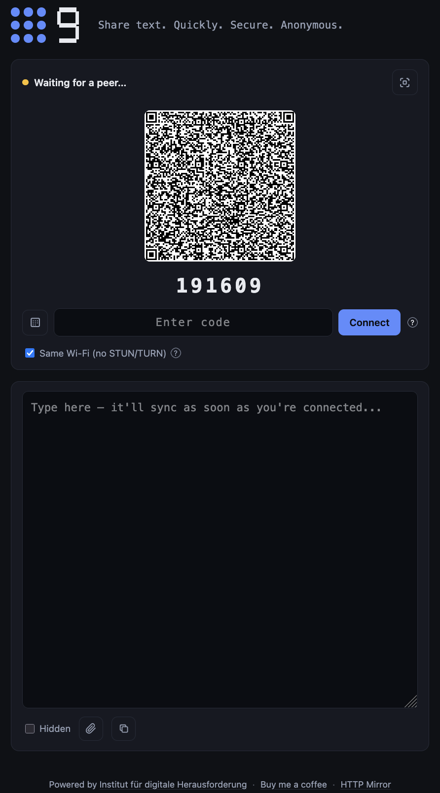

# 9 - Share text. Quickly. Secure. Anonymous.

**Share a bit of text between two devices, instantly and privately.**

Open the same page on both devices, connect them with a QR scan or a
6-digit code, and whatever you type in one shows up in the other in real
time. The text travels over a direct, DTLS-encrypted WebRTC connection
between the two devices — no server ever sees it, and nothing is stored
anywhere.

Perfect for those little "how do I get this string from here to there?"
moments where email, chat, or reading it aloud all feel wrong.



## Getting started

1. Open the page on both devices. Each one instantly shows a QR code and
   a 6-digit code — no button press needed.
2. On the device you want to connect *from*, hit **Connect** and either:
   - **scan** the other device's QR with the in-page camera, or
   - **type** the 6-digit code (or tap it in on the on-screen numpad).
3. That's it — the connection opens automatically and the shared text
   area syncs both ways.

**Same Wi-Fi (no STUN/TURN)** is checked by default — the quickest and
most anonymous option, connecting the two devices directly over the
local network with no external server involved. Uncheck it if the
devices aren't on the same network, so a public STUN server and TURN
relay can help them find each other (still peer-to-peer for the actual
shared text).

Reloading always gives you a fresh code. Scanning the QR with your
phone's normal camera app works too: it opens a link that auto-connects
on load, no extra tap needed.

## What it can do

**Connecting**

- Auto-generates a QR code + 6-digit code on page load — zero clicks.
- Two ways to enter someone else's code: scan their QR (the camera swaps
  into the same slot) or use the on-screen numpad / type it manually.
- **Dual signaling mode:** scanning the QR embeds the connection offer
  directly, so it never touches Cloudflare; typing or tapping in the code
  fetches it through a tiny Cloudflare relay instead.
- **Same Wi-Fi (no STUN/TURN)** toggle, checked by default for the
  quickest and most anonymous LAN-only connection; uncheck it for
  cross-network NAT traversal via Google STUN and a Cloudflare TURN
  relay — with tooltips explaining both that and the Cloudflare relay.
- The Connect card auto-collapses once paired, giving the text area the
  full space.

**Text sharing**

- Instant, debounced two-way sync over a direct WebRTC DataChannel
  (DTLS-encrypted, fully peer-to-peer — no server ever sees the content).
- The text area isn't locked while waiting for a peer — type (or pick a
  file) before anyone's connected, and it sends automatically the moment
  a peer joins.
- **Hidden mode:** masks the text area with dots, briefly revealing each
  edit for ~900ms before re-masking (native browser masking, so copy and
  sync still work on the real text underneath). Synced live to the peer.
- One-click **Copy to clipboard** — always copies the real text, even
  while masked.

**File sharing**

- Send a file (up to 25MB) straight over the same DataChannel — chunked
  and backpressure-aware, so it can't flood the connection or stall it.
- Pick a file before a peer has joined and it queues, sending
  automatically as soon as the connection opens — same as pre-typed text.
- The receiving device gets an automatic download prompt once the
  transfer completes, no extra click needed.
- Whole file is reassembled in memory before it can be saved, so it's
  bounded by device memory — fine for documents/images/screenshots, not
  meant for multi-GB transfers (especially on mobile Safari).

**Design**

- Two-column header: a seven-segment CSS "9" (no font dependency) plus a
  3×3 accent dot grid sized to match.
- Dark, compact, single-card connect UI with hover tooltips on the QR and
  the Same-Wi-Fi toggle.
- Footer with credit links (Institut für digitale Herausforderung, Buy Me
  a Coffee, HTTP Mirror).

## Where it comes in handy

- **Wi-Fi password to a guest** — no reading it aloud, no sticky note.
- **2FA / TOTP setup secret** from phone to laptop when adding a new
  authenticator app.
- **SSH public key or GPG fingerprint** between two machines during
  setup, without a USB stick.
- **API key / webhook secret** between dev machines — avoids pasting into
  Slack or email where it lingers in history and logs.
- **Support / IT handoff** — hand a user a temp password without saying it
  out loud in an open office.
- **Boarding pass / confirmation code** between your phone and a kiosk or
  check-in desk.
- **CLI → browser handoff** — copy a device-flow code or local dev URL
  from a terminal to whatever screen you're actually looking at.

## Why there's a signaling relay

WebRTC needs the two devices to swap a one-time connection handshake (an
SDP offer/answer) before a direct link exists — and that's too large to
fit inside a 6-digit code on its own. `worker/` is a tiny Cloudflare
Worker + KV store that holds each pending handshake under its code for 10
minutes, then expires it right after use. It only ever sees connection
setup metadata — never your shared text.

Scanning the QR skips the relay entirely, because the handshake is
embedded straight into the QR itself.

## Development

```bash
npm install
npm run dev      # dev server (needs the worker running too, see below)
npm run build    # static production build in dist/
npm run preview  # serve the production build
```

Run the signaling worker locally in a second terminal:

```bash
cd worker
npx wrangler dev --port 8787
```

The app talks to the worker via `VITE_SIGNAL_URL`, defaulting to
`http://localhost:8787` for local dev.

The production build is a static bundle — deploy `dist/` to any static
host, it does not need its own backend beyond the small worker.

## Deployment (GitHub Pages + Cloudflare)

### Pages site

`.github/workflows/deploy.yml` builds and deploys `dist/` to GitHub Pages
via GitHub Actions on every push to `main`. One-time setup:

1. In the repo's **Settings → Pages**, set **Source** to "GitHub Actions".
2. `public/CNAME` already points Pages at `9.1-1-1.de`; if you change the
   domain, update that file to match.
3. In Cloudflare DNS for the domain, add a `CNAME` record pointing to
   `nickyreinert.github.io`. Leave it **DNS only** (grey cloud) until
   GitHub issues its TLS cert for the custom domain, then you can proxy
   it (orange cloud) with SSL/TLS mode set to Full or Full (strict).
4. Once the domain resolves, enable **Enforce HTTPS** in the Pages
   settings.

### Signaling worker

1. `cd worker && npx wrangler login` (one-time, opens a browser to
   authorize your Cloudflare account).
2. Create the KV namespace: `npx wrangler kv namespace create SESSIONS`,
   then copy the resulting `id` into `worker/wrangler.toml`.
3. `npx wrangler deploy` — prints the worker's URL, e.g.
   `https://qr-p2p-signal.<your-subdomain>.workers.dev`.
4. In the GitHub repo, add a repository **variable** (Settings → Secrets
   and variables → Actions → Variables) named `SIGNAL_URL` set to that
   URL. The deploy workflow passes it into the build as
   `VITE_SIGNAL_URL`.
5. Re-run the deploy workflow (or push again) so the site picks it up.

### TURN server (for NAT traversal across networks)

STUN alone can't connect two peers when one is behind a strict/symmetric
NAT — carrier mobile hotspots (CGNAT) are the common case — and ICE will
fail with an error like "ICE failed, add a TURN server". The worker can
mint short-lived credentials for [Cloudflare's Realtime TURN
service](https://developers.cloudflare.com/realtime/turn/) so the app has
a relay fallback:

1. In the Cloudflare dashboard, go to **Realtime → TURN** and create a
   TURN key. Note its **Turn Token ID** and generate an **API Token**.
2. Set both as worker secrets:
   ```bash
   cd worker
   npx wrangler secret put TURN_KEY_ID
   npx wrangler secret put TURN_KEY_API_TOKEN
   ```
3. Re-deploy the worker: `npx wrangler deploy`.

No client-side config needed — the app fetches `GET /turn` from the
signaling worker and merges the returned ICE servers in automatically.
If the secrets aren't set, `/turn` returns an empty list and the app
falls back to STUN-only, same as before.

## Release notes

**Latest**

- Peer-to-peer text sync over a direct, DTLS-encrypted WebRTC DataChannel
- Auto-generated QR + 6-digit code, with QR-scan or numpad/manual entry
- Dual signaling: QR embeds the offer (no relay); codes use the Cloudflare relay
- Same-Wi-Fi (LAN-only, default) vs. STUN+TURN toggle for cross-network connections
- Hidden mode with per-edit reveal, synced live to the peer, plus one-click copy
- Scanning the QR preselects the Same-Wi-Fi and Hidden settings on the joining device
- TURN relay fallback (Cloudflare) for peers behind strict/symmetric NAT
- Text area and file picker both work pre-connection and auto-send once a peer joins
- File transfer (up to 25MB) over the same DataChannel, with an automatic download on receipt
- Static Vite build on GitHub Pages, ephemeral Cloudflare Worker + KV relay (10-min TTL)
